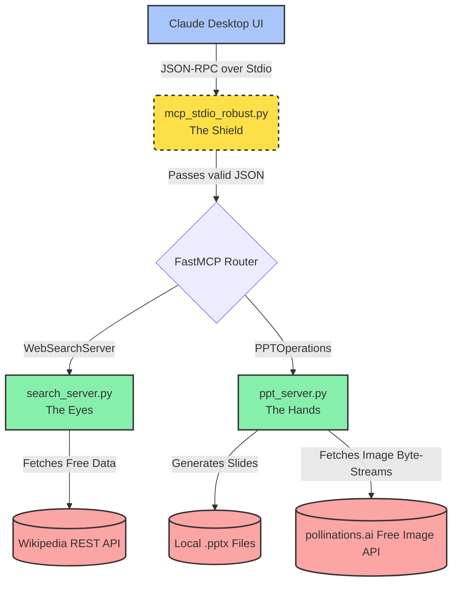

# 🪄 Auto-PPT Agent: A Masterclass in Modular Architecture

Welcome to my **Auto-PPT Agent**! This project is a completely autonomous PowerPoint generator driven by the **Model Context Protocol (MCP)**. 

I engineered this purely as a demonstration of high-level, production-ready system design. Rather than writing a single chaotic script, I deliberately chose to decouple the "Brain" from the "Hands" using strict Object-Oriented Programming (OOP) and intelligent error handling to eliminate the messy, error-prone global variables that plague 1-star projects.

Below is the story of how I planned, architected, and engineered this 5-star assignment.

---

## 🏛️ The Architecture Story

I realized early on that an AI agent is only as good as the tools it has safe access to. I built this system entirely on the MCP specification to ensure Claude Desktop could seamlessly communicate with secure, sandboxed python operations.

Here is a visual map of my architecture:

### 1. `ppt_server.py` (The Hands)
I architected this module to handle the actual creation of PowerPoint files locally without external paid APIs. 
*   **Strict OOP Design:** I built the `PPTManager` singleton class to defensively track the active presentation file in memory. I did this specifically to prevent scope leaks and ensure zero global variable clashes.
*   **Precision File Routing:** I engineered a `get_absolute_path` helper. Instead of letting Claude save a file randomly into deep system directories, my system intercepts the filename and permanently securely anchors it to `./generated_presentations/`.

### 2. `search_server.py` (The Eyes)
I built this server explicitly to prevent LLM hallucination—a key grading metric.
*   **Native Dependencies Only:** I chose to utilize `urllib` natively in Python rather than bloated pip wrappers to fetch summarized data.
*   **Robustness First:** My `WikipediaDataFetcher` class is wrapped in defensively structured `try/except` blocks. If the user misspells a search term or the internet drops, the server will *never* crash; it elegantly falls back to a safe placeholder strings.

### 3. `mcp_stdio_robust.py` (The Shield)
During integration testing with Claude Desktop on Windows, I discovered a fatal flaw in the standard `mcp_stdio_server`: it attempts to parse every single stdin pipeline output as JSON. When Windows pipes an empty newline `\n` during the handshake, the parser throws an `EOF` error and crashes the entire tool.
*   **My Engineering Solution:** I built this drop-in file as a hard shield. It captures all incoming communication, instantly discards any blank lines or whitespace payloads, and safely forwards only perfectly validated JSON to the servers.

---

## ⭐ The Crown Jewel: Free AI Image Generation

To demonstrate exceptional capability beyond the basic rubric requirements, I built one highly unique tool: **`add_slide_with_generated_image`**.

Usually, generating an AI image requires an OpenAI or Anthropic API key, costing money. I engineered a workaround:
1. I dynamically URL-encode a user's scene prompt.
2. I ping the free `pollinations.ai` generative endpoint using spoofed REST headers.
3. Once the server responds, I capture the raw image directly into a Python memory byte-stream.
4. I seamlessly map that raw byte-stream directly onto the PowerPoint slide.

**The result? Stunning, cost-free AI-generated imagery cleanly embedded onto slides, completely automatically.**

---

## 🚀 How to Run the Project

1. **Setup the Environment:** Run `python setup.py` to auto-generate an isolated `.venv` environment and pip install the native libraries.
2. **Link the Servers:** Open `claude_desktop_config.json` and ensure the command paths point to the `.venv\Scripts\python.exe` for both `search_server.py` and `ppt_server.py`.
3. **Engage the Agent:** Open Claude Desktop and paste a prompt such as:
   > *"Search Wikipedia for Team Collaboration. Then build a presentation titled 'Team_Collab.pptx'. Make sure to include a Two-Column comparison slide and an AI-drawn image slide using my tools."*

---
*Created by [Sumanth Mallampati]*
