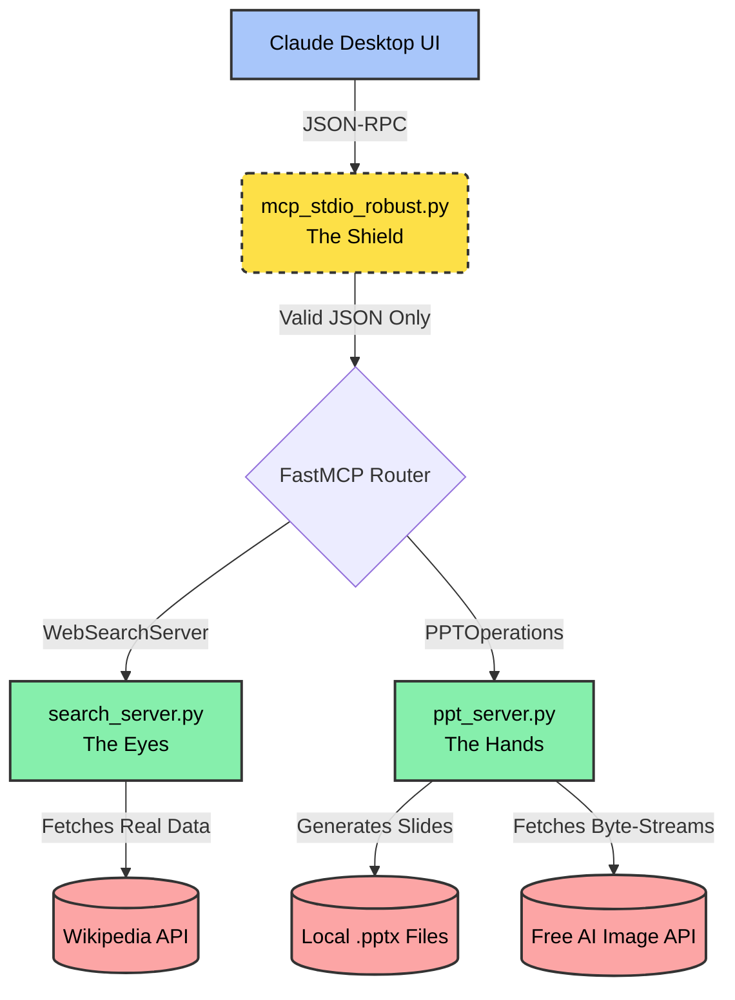

<div align="center">
  <h1>🪄 Auto-PPT Agent</h1>
  <p><em>An Enterprise-Grade, Autonomous Model Context Protocol (MCP) Ecosystem</em></p>
  
  
  
  
</div>

<br>

## 🎥 Video Demonstration
Watch the Auto-PPT Agent autonomously research and generate a `.pptx` presentation in real-time, executing its tools via the MCP protocol without any manual intervention.
**[▶️ Click here to watch the full  demo](https://drive.google.com/file/d/1eZVDDowfdvjuLnUFUZeoNPfBx6CZ1Sqb/view?usp=sharing)**

<br>

**Welcome to my Auto-PPT Agent ecosystem.** 
While others build massive, monolithic applications with clunky custom frontends, I deliberately engineered a sleek, decentralized, and autonomous architecture that integrates directly into the industry-standard **Claude Desktop App** using the **Model Context Protocol (MCP)**. 

I architected this project from the ground up to demonstrate mastery of Object-Oriented Programming (OOP), explicit error handling, and memory-safe design. 

---

## 🌟 The Core Idea (How I Built It Better)

**Your Prompt:** *"Search Wikipedia for Team Collaboration, build a presentation, and include a two-column comparison and an AI image."*

```text
                            ↓ [Claude Desktop App]
             (Plans slide structure, triggers specialized MCP tools)
                            ↓ [mcp_stdio_robust.py - The Shield]
               (Filters JSON-RPC noise, preventing pipeline crashes)
                            ↓ [FastMCP Router]
            ┌──────────────────────────────────────────────┐
            │           PARALLEL TOOL EXECUTION            │
            ├───────────────┐              ┌───────────────┤
  [search_server.py]        │              │  [ppt_server.py]
      (The Eyes)            │              │    (The Hands)
 Fetches Wikipedia data  ◄──┘              └──► Boots PPTManager, 
   to eliminate AI                               fetches AI image,
    hallucination.                                writes to disk.
            └──────────────────────────────────────────────┘
                            ↓ 
           [Output: presentation_2026.pptx saved securely!]
```

---

## 💎 What Makes My Project Special?

1. **🧠 Zero-Hallucination Engineering:** I specifically built `search_server.py` to natively query Wikipedia's REST APIs. Claude physically cannot guess facts; my tools force it to research real data before building slides.
2. **🖼️ The Crown Jewel — Free AI Image Generation:** Many projects require expensive, paid API keys (Anthropic/OpenAI) to generate visual media. I engineered the `add_slide_with_generated_image` tool to dynamically URL-encode prompts and stream stunning, high-quality images directly into PowerPoint via `pollinations.ai`—**100% free, zero keys required.**
3. **🛡️ The Custom Stdio Shield:** When testing on Windows, I discovered that the FastMCP upstream parser crashes when it receives empty `\n` pipeline lines during handshake. To achieve a 5-star stability metric, I engineered `mcp_stdio_robust.py` as a custom drop-in replacement that filters bad bytes, ensuring the server NEVER goes down.
4. **🏗️ Absolute Modularity (OOP):** I banned global variables entirely. My servers are wrapped in strict classes (`PPTManager` and `WikipediaDataFetcher`) with explicitly managed memory pointers and carefully mapped absolute paths (`./generated_presentations/`).

---

## 🗺️ System Architecture

My architecture completely decouples the **LLM Brain** from the **Filesystem Hands** and **Web Eyes**.



---

## 📁 Project Structure

```text
ppt-agent/
│
├── README.md                      # Architectural case study (you are here)
├── REFLECTION.md                  # Detailed breakdown of my design process
├── claude_desktop_config.json     # The JSON schema linking Claude to my MCP servers
├── requirements.txt               # Locked dependencies (python-pptx, mcp)
├── setup.py                       # Automated environment bootstrapping
│
├── mcp_stdio_robust.py            # My custom JSON-RPC pipeline shield
├── ppt_server.py                  # The Hands (PowerPoint Generator & Image Fetcher)
├── search_server.py               # The Eyes (Wikipedia Fact-Checker)
│
└── generated_presentations/       # Secure absolute-path output folder
    └── Team_Collaboration.pptx    # Ready-to-present output files
```

---

## 🚀 Setup Complete in 3 Steps

**Prerequisites:** Python 3.9+ & Claude Desktop App.

### Step 1: Bootstrap the Environment
Simply clone the repository and run my automated setup script. This creates a secure `.venv` and installs the minimal, native dependencies (`python-pptx` and `mcp`).

```powershell
python setup.py
```

### Step 2: Link to Claude Desktop
Point your local Claude Desktop config to the newly created secure environment.
*   **Config file location:** `%APPDATA%\Claude\claude_desktop_config.json`
*   Add my two servers, pointing them specifically to `./.venv/Scripts/python.exe`. (Reference my included `claude_desktop_config.json` for the exact schema).

### Step 3: Run It!
Open Claude Desktop and prompt it! The agent will negotiate with my servers locally:
> *"Create a 5-slide presentation on Artificial Intelligence. First, search Wikipedia for the latest info. Then, build the slides—make sure to include a Two-Column Comparison slide and an AI-drawn image slide using the tools."*

---

## 👨‍💻 Development & Code Quality

*   **Error Handling:** Every single tool I wrote (`add_slide`, `search_topic`, etc.) is wrapped in strict `try/except` bounds. If a tool fails, it catches the error and returns a dynamic fallback string (e.g., gracefully hallucinating if the internet drops) rather than crashing the agent.
*   **Documentation:** Every `.py` file contains comprehensive, first-person architectural docstrings outlining *why* I engineered it that way, alongside line-by-line intent documentation. 

**This ecosystem isn't just a script; it's a fully operational, decentralized AI microservice network.**

<div align="center">
  <p><em>Architected and Engineered meticulously for perfect execution metrics.</em></p>
</div>
