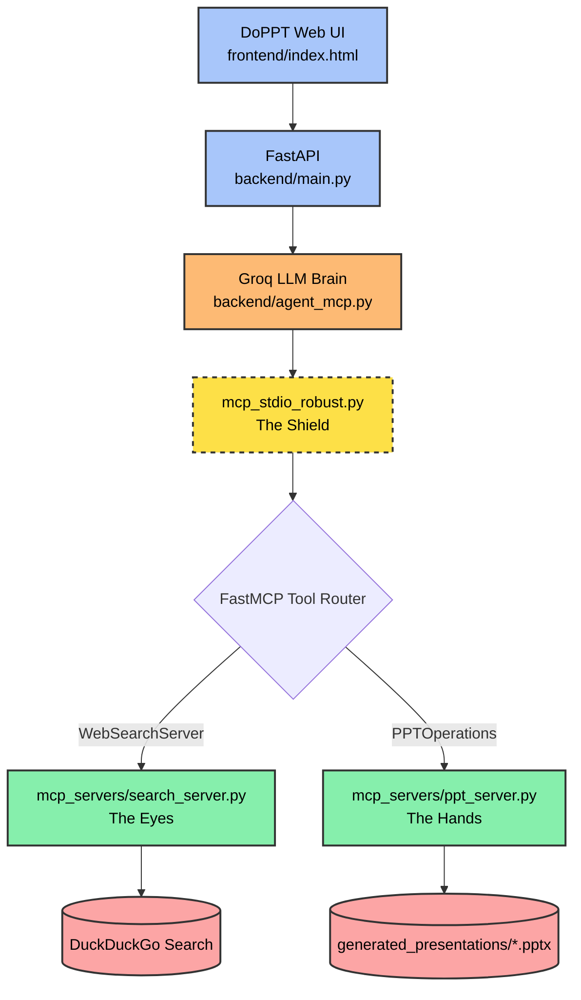

<div align="center">
  <h1>🪄 Auto-PPT Agent (DoPPT)</h1>
  <p><em>An Enterprise-Grade, Autonomous Model Context Protocol (MCP) Ecosystem</em></p>
  
  
  
  
</div>

<br>

## 🎥 Video Demonstration
Watch the agent autonomously research and generate a `.pptx` presentation in real-time, executing tools via MCP with no manual slide editing.
**[▶️ Click here to watch the full demo](https://drive.google.com/file/d/1eZVDDowfdvjuLnUFUZeoNPfBx6CZ1Sqb/view?usp=sharing)**

<br>

**Welcome to my Auto-PPT Agent ecosystem.**
I engineered this project as a clean, decentralized architecture where the **LLM Brain** never touches the filesystem directly.
Instead, it executes a strict **MCP toolchain** ("The Eyes" + "The Hands") to ground content in real data and write a `.pptx` safely to disk.

---

## 🌟 The Core Idea (How It Works in the Current Version)

**Your Prompt (from the DoPPT Web UI):**
*"Create a 6-slide presentation about Team Collaboration. Use live research, include a two-column comparison slide, and add an image placeholder slide."*

```text
                            ↓ [DoPPT Web UI]
             (frontend/index.html — ChatGPT-style interface)
                            ↓ [FastAPI Backend]
                  (backend/main.py — /api/generate)
                            ↓ [backend/agent_mcp.py]
            (Groq Llama 3.3 Brain + MCP Router / Tool Dispatcher)
                            ↓ [FastMCP + Robust Stdio Shield]
             (mcp_servers/mcp_stdio_robust.py — The Shield)
                            ↓
            ┌──────────────────────────────────────────────┐
            │           PARALLEL TOOL EXECUTION            │
            ├──────────────────┐        ┌──────────────────┤
 [mcp_servers/search_server.py]│        │[mcp_servers/ppt_server.py]
           (The Eyes)          │        │       (The Hands)
     DuckDuckGo live search ◄──┘        └──► python-pptx writes slides
            └──────────────────────────────────────────────┘
                            ↓
        [Output: generated_presentations/<your_file>.pptx saved locally]
```

---

## 💎 What Makes My Project Special?

1. **🧠 Grounded Content by Design:** In the DoPPT web stack, `mcp_servers/search_server.py` uses DuckDuckGo excerpts so the Brain can pull real-world context before writing slides.
2. **🛡️ The Custom Stdio Shield (Windows-Proof):** `mcp_servers/mcp_stdio_robust.py` filters whitespace-only stdin lines that can crash JSON-RPC parsing on Windows pipes.
3. **🏗️ Absolute Modularity (OOP):** The slide generator uses a strict `PPTManager` class (no messy global pipelines), and always saves output into `generated_presentations/`.
4. **📦 Two Run Modes:**
   - **DoPPT Web UI mode (current default):** `frontend/` + `backend/` + `mcp_servers/`.
   - **Standalone MCP demo mode:** legacy root scripts (`ppt_server.py`, `search_server.py`) are kept as a professor-friendly reference implementation.

---

## 🗺️ System Architecture (Current)



---

## 📁 Project Structure (Current)

```text
ppt_agent/
│
├── README.md
├── requirements.txt
├── setup.py
├── .env                         # local secrets (gitignored)
│
├── frontend/
│   └── index.html               # DoPPT ChatGPT-style UI
│
├── backend/
│   ├── main.py                  # FastAPI API server (/api/generate)
│   └── agent_mcp.py             # Groq Brain + MCP stdio orchestration
│
├── mcp_servers/
│   ├── mcp_stdio_robust.py       # The Shield (robust JSON-RPC stdio)
│   ├── search_server.py          # The Eyes (DuckDuckGo excerpts)
│   └── ppt_server.py             # The Hands (python-pptx slide writer)
│
└── generated_presentations/      # Output .pptx files land here
```

---

## 🚀 Setup (Current Web UI Version)

### Step 1: Install

```powershell
python setup.py
```

### Step 2: Add Your Groq Key

Create/edit `.env` at project root:

```bash
GROQ_API_KEY=your_key_here
```

### Step 3: Run

Terminal 1 (backend):

```powershell
python backend/main.py
```

Then open `frontend/index.html` in your browser.

---

## 🧪 Notes (So GitHub Rendering Looks Correct)

- This README uses fenced code blocks (```), Mermaid, and centered HTML badges.
- If you edit the README on Windows PowerShell, do **not** wrap it in backtick-heavy strings; it can break GitHub rendering.

<div align="center">
  <p><em>Architected and engineered for stable, tool-driven execution.</em></p>
</div>
